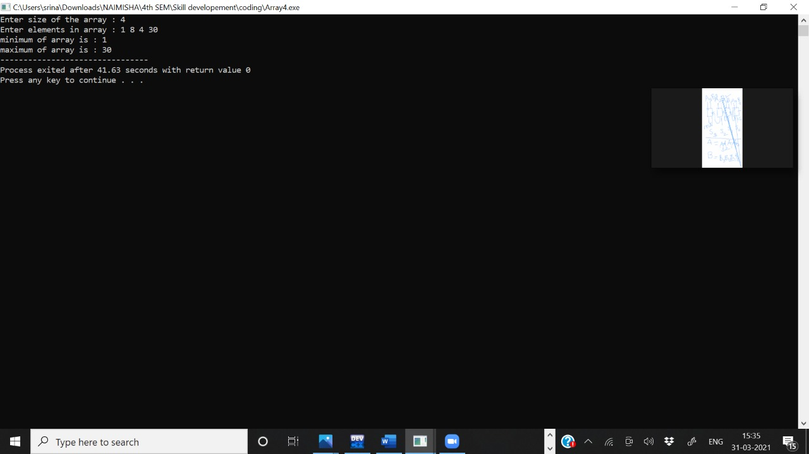
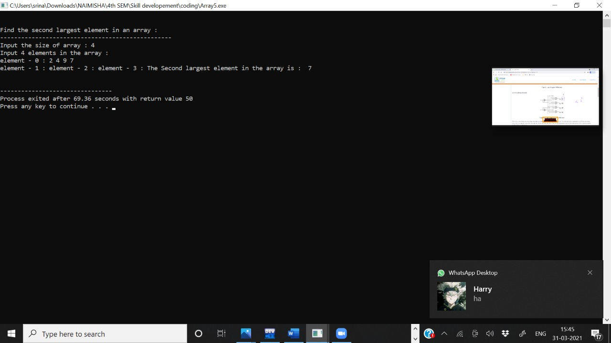
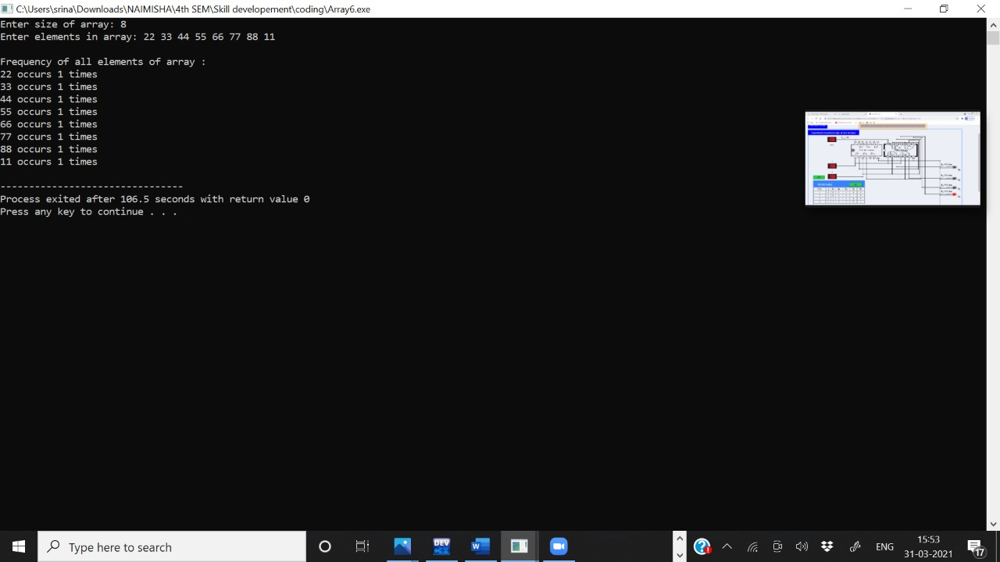
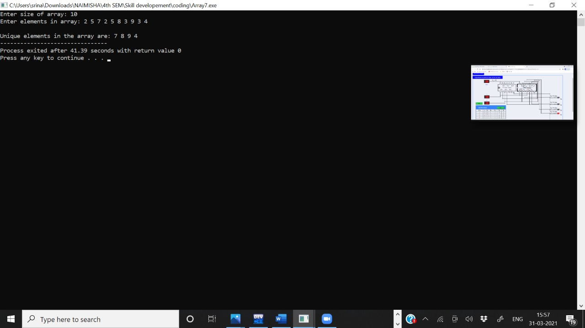
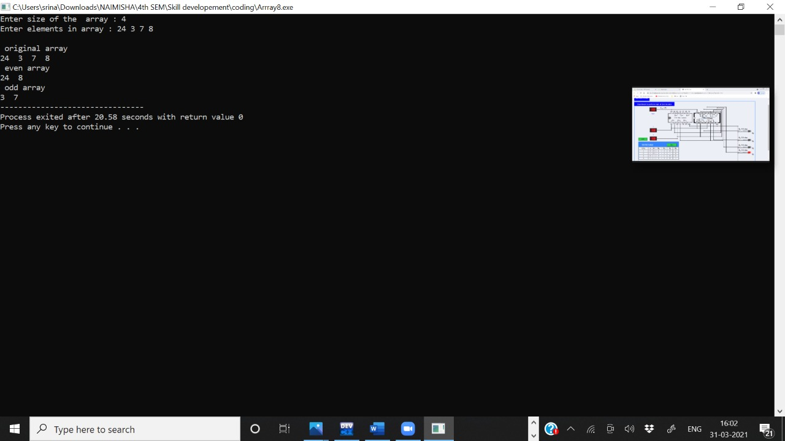
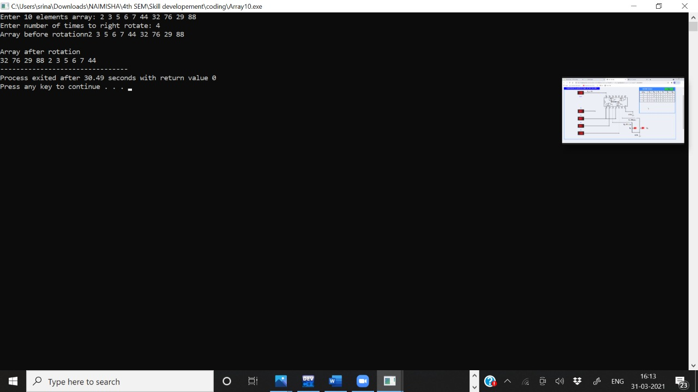

# PROGRAM 1 -- C program to read and print elements of  array using recurssion 

### code :

#include<stdio.h>  
  
void  main()  
{  
    int arr[10]; 
    int i;  
       	
  
    printf("Input 10 elements in the array :\n");  
    for(i=0; i<10; i++)  
    {  
	    printf("element - %d : ",i);
        scanf("%d", &arr[i]);  
    }  
  
    printf("\nElements in array are: ");  
    for(i=0; i<10; i++)  
    {  
        printf("%d  ", arr[i]);  
    } 
    printf("\n");	
}

# output-1 : 

---------------------------------------------------------------------------------

# PROGRAM 2 -- C program to print all negative elements of an array 

### code:- 

#include <stdio.h>

#define MAX_SIZE 100 // Maximum array size

int main()
{
    int arr[MAX_SIZE]; // Declare array of MAX_SIZE
    int i, N;

    /* Input size of the array */
    printf("Enter size of the array : ");
    scanf("%d", &N);

    /* Input elements in the array */
    printf("Enter elements in array : ");
    for(i=0; i<N; i++)
    {
        scanf("%d", &arr[i]);
    }

    printf("\nAll negative elements in array are : ");
    for(i=0; i<N; i++)
    {
        /* If current array element is negative */
        if(arr[i] < 0)
        {
            printf("%d\t", arr[i]);
        }
    }

    return 0;
}

# OUTPUT-2 -
 

-------------------------------------------------------------------------------

# PROGRAM 3 - c program to find sum of all array elements 

### CODE :- 

#include <stdio.h>

void main()
{
    int a[100];
    int i, n, sum=0;
	
	
       printf("\n\nFind sum of all elements of array:\n");
       printf("--------------------------------------\n");	

       printf("Input the number of elements to be stored in the array :");
       scanf("%d",&n);
   
       printf("Input %d elements in the array :\n",n);
       for(i=0;i<n;i++)
        {
	      printf("element - %d : ",i);
	      scanf("%d",&a[i]);
	    }

    for(i=0; i<n; i++)
    {
        sum += a[i];
    }

    printf("Sum of all elements stored in the array is : %d\n\n", sum);
}

# OUTPUT-3 

----------------------------------------------------------------------------------

# PROBLEM 4 - C problem to find maximum and minimum elements of array using recursion 

### code :- 

#include <stdio.h>
 #include <conio.h>
 
 
int main()
{
    int a[1000],i,n,min,max;
   
    printf("Enter size of the array : ");
    scanf("%d",&n);
 
    printf("Enter elements in array : ");
    for(i=0; i<n; i++)
    {
        scanf("%d",&a[i]);
    }
 
    min=max=a[0];
    for(i=1; i<n; i++)
    {
         if(min>a[i])
		  min=a[i];   
		   if(max<a[i])
		    max=a[i];       
    }
     printf("minimum of array is : %d",min);
          printf("\nmaximum of array is : %d",max);
 
 
    
}

# OUTPUT-4 :

----------------------------------------------------------------------------------

# PROGRAM - 5: C program to find second largest elements in an array 

### code: 

#include <stdio.h>

void main(){
  int arr1[50],n,i,j=0,lrg,lrg2nd;
 
  
       printf("Input the size of array : ");
       scanf("%d", &n);
    
       printf("Input %d elements in the array :\n",n);
       for(i=0;i<n;i++)
            {
	      printf("element - %d : ",i);
	      scanf("%d",&arr1[i]);
	    }
	
//   lrg=arr1[0];
   lrg=0;
  for(i=0;i<n;i++)
  {
      if(lrg<arr1[i])
	  {
           lrg=arr1[i];
           j = i;
      }
  }
		
   lrg2nd=0;
  for(i=0;i<n;i++)
  {
     if(i==j)
        {
          i++;  
		  i--;
        }
      else
        {
          if(lrg2nd<arr1[i])
	     {
               lrg2nd=arr1[i];
             }
        }
  }

  printf("The Second largest element in the array is :  %d \n\n", lrg2nd);
}

# output -5 

----------------------------------------------------------------------------------

# PROGRAM 6 - C program to count the frequency of each element in an array 

### code: 

#include <stdio.h>

int main()
{
    int arr[100], freq[100];
    int size, i, j, count;

    /* Input size of array */
    printf("Enter size of array: ");
    scanf("%d", &size);

    /* Input elements in array */
    printf("Enter elements in array: ");
    for(i=0; i<size; i++)
    {
        scanf("%d", &arr[i]);

        freq[i] = -1;
    }

    for(i=0; i<size; i++)
    {
        count = 1;
        for(j=i+1; j<size; j++)
        {
            /* If duplicate element is found */
            if(arr[i]==arr[j])
            {
                count++;

                freq[j] = 0;
            }
        }

        if(freq[i] != 0)
        {
            freq[i] = count;
        }
    }

   
    printf("\nFrequency of all elements of array : \n");
    for(i=0; i<size; i++)
    {
        if(freq[i] != 0)
        {
            printf("%d occurs %d times\n", arr[i], freq[i]);
        }
    }

    return 0;
}

# OUTPUT 6 - 

-----------------------------------------------------------------------------------

# PROGRAM 7 - C program to print all unique elements in an array

### code: 

#include <stdio.h>
int main()
{
    int arr1[100], n,ctr=0;
    int i, j, k;
   
       printf("Input the number of elements to be stored in the array: ");
       scanf("%d",&n);
       printf("Input %d elements in the array :\n",n);
       for(i=0;i<n;i++)
            {
	      printf("element - %d : ",i);
	      scanf("%d",&arr1[i]);
	    }
    printf("\nThe unique elements found in the array are: \n");
    for(i=0; i<n; i++)
    {
        ctr=0;
        for(j=0,k=n; j<k+1; j++)
        {
            
            if (i!=j)
            {
		       if(arr1[i]==arr1[j])
              {
                 ctr++;
               }
             }
        }
       if(ctr==0)
        {
          printf("%d ",arr1[i]);
        }
    }
       printf("\n\n");
}

# OUTPUT 7 :

-----------------------------------------------------------------------------------

# PROGRAM 8 - C program to put even and odd elements of array in two separate array 

### code: 

#include <conio.h>
print(int *a,int n)
 { 
    int i;
    
	
 
    for(i=0; i<n; i++)
    {
      
        	printf("%d  ",a[i]);
 
		 
    }
 	
 }
  
 
int main()
{
    int a[10000],b[10000],c[20000],i,j,k,n1,n2,n ;
   
    printf("Enter size of the  array : ");
    scanf("%d", &n);
    printf("Enter elements in array : ");
    for(i=0; i<n; i++)
    {
        scanf("%d",&a[i]);
    }
     printf("\n original array  \n");
 
    print(a,n);
    j=k=0;
    for(i=0; i<n; i++)
    {
        if(a[i]%2==0)
          b[j++]=a[i];
        else
          c[k++]=a[i];
 
    }
     
    printf(" \n even array \n");
 
    print(b,j);
    printf(" \n odd array \n");
 
    print(c,k);
        
        
   
 
  
    return 0;
} 

# OUTPUT 8 : 

------------------------------------------------------------------------------------

# PROGRAM 9 - c program to sort even and odd elements in an array separately

### code: 

 #include <conio.h>
 
 int main()
{
    int a[10000],b[10000],i,n,j,k,temp,c=0;
   
    printf("Enter size of the  array : ");
    scanf("%d", &n);
    printf("Enter elements in array : ");
    for(i=0; i<n; i++)
    {
        scanf("%d",&a[i]);
        if(a[i]%2==1)
         c++;
    }
    for(i=0; i<n-1; i++)
    {
           
        for(j=0; j<n-i-1; j++)
        {
           if(a[j]>a[j+1])
           {
           	temp=a[j];
           	a[j]=a[j+1];
           	a[j+1]=temp;
		   }
 
        }
       
    }   
	
	k=0;
    j=n-c;
    
	for(i=0; i<n; i++)
    {
        if(a[i]%2==0)
        {
        	if(k<n-c)
        	  b[k++]=a[i];
		}  
		else
		{
			if(j<n)
        	  b[j++]=a[i];
	    }
    }
    
    printf("\narray after sorting even and odd elements separately:\n ");
 
    for(i=0; i<n; i++)
    {
    	a[i]=b[i];
       printf("%d ",a[i]);
    }
    
 } 

 # output 9 - 

 -----------------------------------------------------------------------------

 #  PROGRAM 10 - c program to right rotate an array 

 ### code: 

 #include <stdio.h>    
     
int main()    
{    
    //Initialize array     
    int arr[] = {1, 2, 3, 4, 5};     
    //Calculate length of array arr    
    int length = sizeof(arr)/sizeof(arr[0]);    
    //n determine the number of times an array should be rotated    
    int n = 3;    
        
    //Displays original array    
    printf("Original array: \n");    
    for (int i = 0; i < length; i++) {     
        printf("%d ", arr[i]);     
    }     
        
    //Rotate the given array by n times toward right    
    for(int i = 0; i < n; i++){    
        int j, last;    
        //Stores the last element of the array    
        last = arr[length-1];    
        
        for(j = length-1; j > 0; j--){    
            //Shift element of array by one    
            arr[j] = arr[j-1];    
        }    
        //Last element of array will be added to the start of array.    
        arr[0] = last;    
    }    
        
    printf("\n");    
        
    //Displays resulting array after rotation    
    printf("Array after right rotation: \n");    
    for(int i = 0; i< length; i++){    
        printf("%d ", arr[i]);    
    }    
    return 0;    
} 

# output 10 : 

