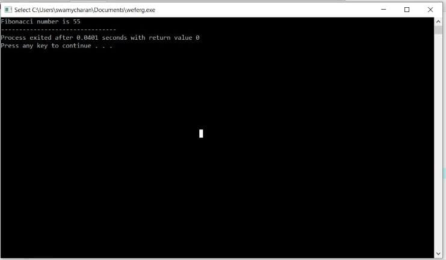
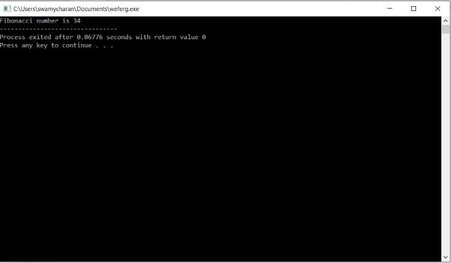

# ASSIGNMENT - 10
------------------------------------------------------------------------------------------------------------------------------------------------------------------------

# PROGRAM  :- Write a C program to demonstrate Dynamic Programming Strategy by implementing Fibonacci series in tabulation and Memorization. 

# code :- 

## A - by memorization 

    #include<stdio.h> 
    #define NIL -1 
    #define MAX 100 

  

    int lookup[MAX]; 

  
    /* Function to initialize NIL values in lookup table */

    void _initialize() 
    { 

    int i; 

    for (i = 0; i < MAX; i++) 

    lookup[i] = NIL; 
    } 

  
    /* function for nth Fibonacci number */

    int fib(int n) 
    { 

    if (lookup[n] == NIL) 

    { 

      if (n <= 1) 

         lookup[n] = n; 

      else

         lookup[n] = fib(n-1) + fib(n-2); 

    } 

  

    return lookup[n]; 
    } 

  
    int main () 
    {  

    int n = 10; 

    _initialize(); 

    printf("Fibonacci number is %d ", fib(n)); 

    return 0; 
    }

# OUTPUT : - 

## B) by tabulation 

# code: - 
  
      /* C program for Tabulated version */
    #include<stdio.h> 

    int fib(int n) 
    { 

    int f[n+1]; 

    int i; 

    f[0] = 0;   f[1] = 1;  

    for (i = 2; i <= n; i++) 

      f[i] = f[i-1] + f[i-2]; 

  

    return f[n]; 
    } 

   

    int main () 
    { 

    int n = 9; 

    printf("Fibonacci number is %d ", fib(n)); 

    return 0; 
    }

# OUTPUT - 

