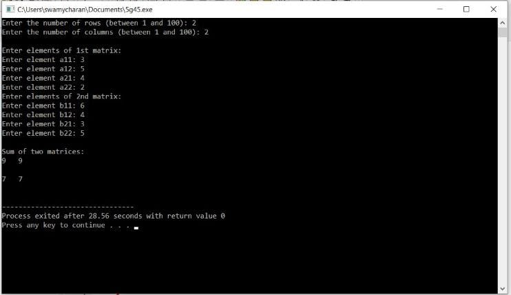
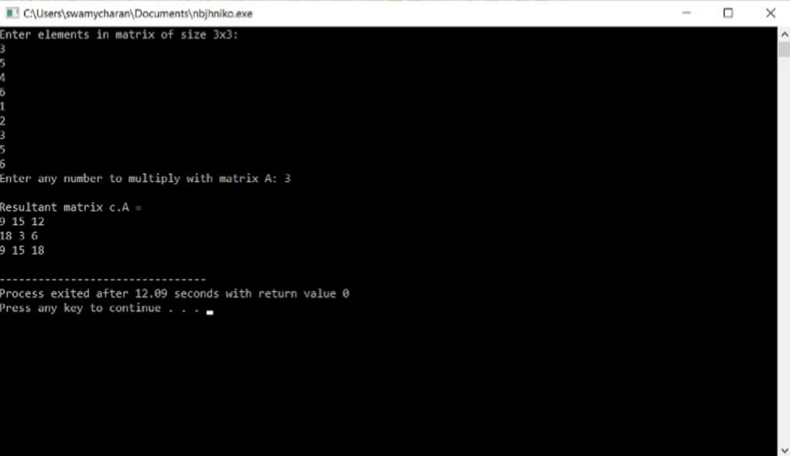
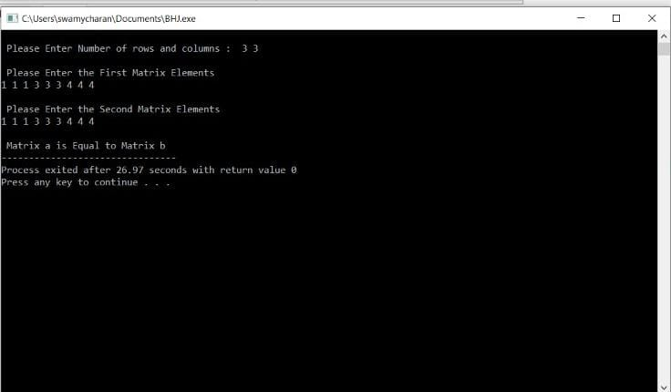
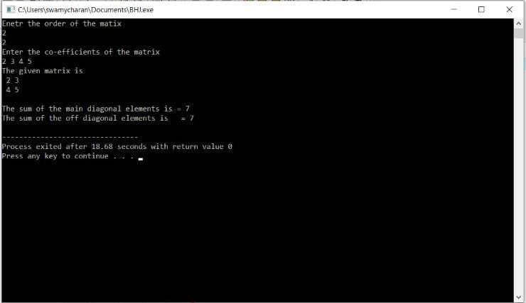
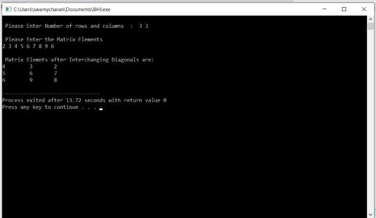
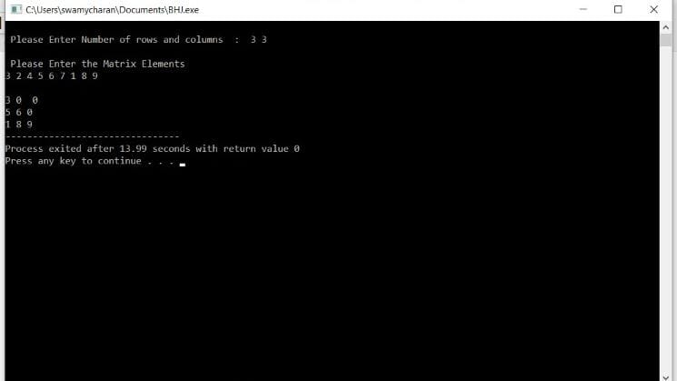
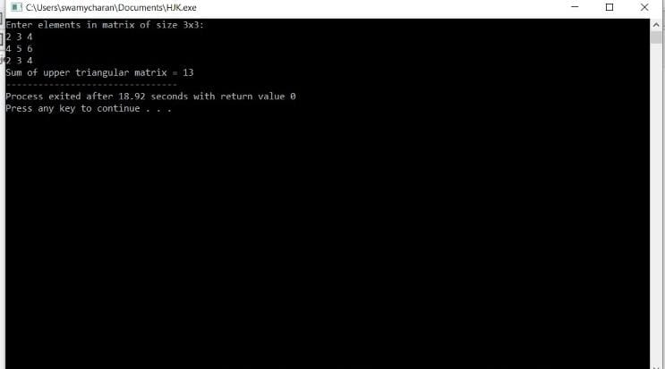
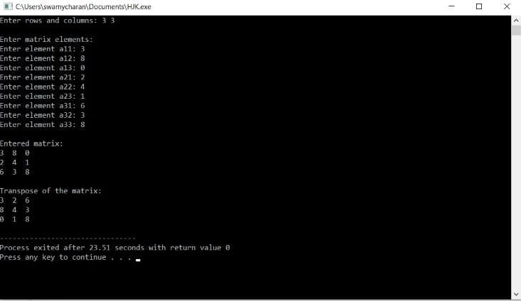
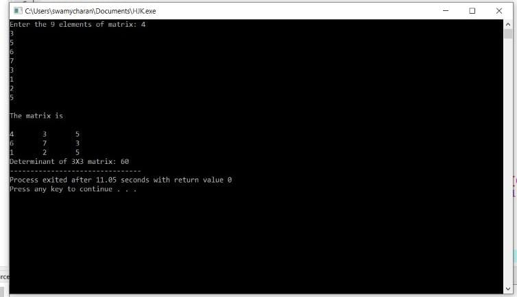
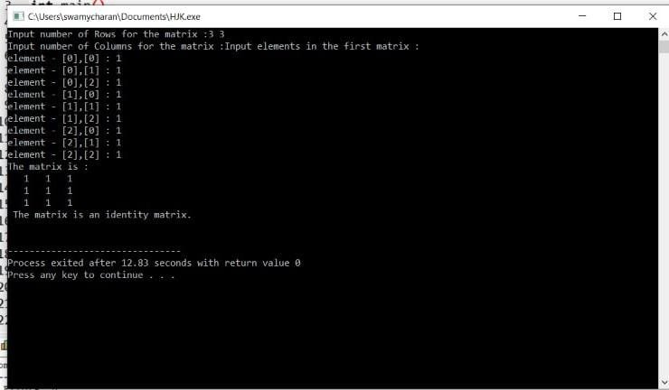

# ASSIGNMENT - 2 - PROGRAM  ON  MATRICEs
------------------------------------------------------------------------------------------------------------------------------------------------------------------------

## PROGRAM 1 - WRITE  C  PROGRAM  TO  ADD  2  MATRICES 

## CODE :

        #include <stdio.h>
        int main() {
        int r, c, a[100][100], b[100][100], sum[100][100], i, j;
        printf("Enter the number of rows (between 1 and 100): ");
        scanf("%d", &r);
        printf("Enter the number of columns (between 1 and 100): ");
        scanf("%d", &c);

        printf("\nEnter elements of 1st matrix:\n");
        for (i = 0; i < r; ++i)
            for (j = 0; j < c; ++j) {
               printf("Enter element a%d%d: ", i + 1, j + 1);
        scanf("%d", &a[i][j]);
        }

        printf("Enter elements of 2nd matrix:\n");
        for (i = 0; i < r; ++i)
            for (j = 0; j < c; ++j) {
               printf("Enter element b%d%d: ", i + 1, j + 1);
        scanf("%d", &b[i][j]);
        }

        for (i = 0; i < r; ++i)
            for (j = 0; j < c; ++j) {
              sum[i][j] = a[i][j] + b[i][j];
        }

        printf("\nSum of two matrices: \n");
        for (i = 0; i < r; ++i)
            for (j = 0; j < c; ++j) {
             printf("%d   ", sum[i][j]);
        if (j == c - 1) {
        printf("\n\n");
             }
        }

        return 0;
        }
    
      
 

# OUTPUT :- 

------------------------------------------------------------------------------------

 
# PROGRAM 2 - WRITE  A  C  PROGRAM  TO  PERFORM  SCALAR  MATRIX  MULTIPLICATION 

 ## CODE : 

    #include <stdio.h>
    #include <stdio.h>

    #define SIZE 3 

    int main()
    {
    int A[SIZE][SIZE]; 
    int num, row, col;

    printf("Enter elements in matrix of size %dx%d: \n", SIZE, SIZE);
    for(row=0; row<SIZE; row++)
    {
        for(col=0; col<SIZE; col++)
        {
            scanf("%d", &A[row][col]);
        }
    }

    printf("Enter any number to multiply with matrix A: ");
    scanf("%d", &num);

    for(row=0; row<SIZE; row++)
    {
        for(col=0; col<SIZE; col++)
        {
        
            A[row][col] = num * A[row][col];
        }
    }

    
    printf("\nResultant matrix c.A = \n");
    for(row=0; row<SIZE; row++)
    {
        for(col=0; col<SIZE; col++)
        {
            printf("%d ", A[row][col]);
        }
        printf("\n");
    }

    return 0;
    }

# OUTPUT :
 
 

------------------------------------------------------------------------------------

# PROGRAM 3- WRITE  A  C  PROGRAM  TO  CHECK  WEATHER  2  MAtrices  ARE  EQUAL  OR  NOT  

# CODE:- 

    #include<stdio.h>
 
    int main()
    {
 	int i, j, rows, columns, a[10][10], b[10][10], isEqual;
  
 	printf("\n Please Enter Number of rows and columns :  ");
 	scanf("%d %d", &i, &j);
 
 	printf("\n Please Enter the First Matrix Elements\n");
 	for(rows = 0; rows < i; rows++)
  	{
   		for(columns = 0;columns < j;columns++)
    	{
      		scanf("%d", &a[rows][columns]);
    	}
  	}
   
 	printf("\n Please Enter the Second Matrix Elements\n");
 	for(rows = 0; rows < i; rows++)
  	{
   		for(columns = 0;columns < j;columns++)
    	{
      		scanf("%d", &b[rows][columns]);
    	}
  	}
  	isEqual = 1;
  	
 	for(rows = 0; rows < i; rows++)
  	{
   		for(columns = 0;columns < j;columns++)
    	{
      		if(a[rows][columns] != b[rows][columns])
			{
			  	isEqual = 0;
			  	break;
			}    
   	 	}
  	}
 	if(isEqual == 1)
 	{
 		printf("\n Matrix a is Equal to Matrix b");		
	}
	else
	{
		printf("\n Matrix a is Not Equal to Matrix b");
	}	
 	return 0;
    }

# OUTPUT :- 

-----------------------------------------------------------------------------------

# PROGRAM 4 - WRITE  A  C  PROGRAM  TO  FIND  SUM   OF  DIAGONAL  ELEMENTS 

# CODE :-

    #include<stdio.h>
    int main()
	    {
 
        static int array[10][10];
        int i, j, m, n, a = 0, sum = 0;
 
        printf("Enetr the order of the matix \n");
        scanf("%d %d", &m, &n);
 
        if (m == n ) 
        {
 
            printf("Enter the co-efficients of the matrix\n");
            for (i = 0; i < m; ++i)
            {
                for (j = 0; j < n; ++j)
                {
                    scanf("%d", &array[i][j]);
                }
            }
 
            printf("The given matrix is \n");
            for (i = 0; i < m; ++i) 
            {
                for (j = 0; j < n; ++j)
                {
                    printf(" %d", array[i][j]);
                }
                printf("\n");
            }
 
            for (i = 0; i < m; ++i) 
            {
                sum = sum + array[i][i];
                a = a + array[i][m - i - 1];
            }
 
            printf("\nThe sum of the main diagonal elements is = %d\n", sum);
            printf("The sum of the off diagonal elements is   = %d\n", a);
 
        }
 
        else
            printf("The given order is not square matrix\n");
 
    }
 

 # OUTPUT :- 

 

-----------------------------------------------------------------------------------

# PROGRAM 5 - WRITE  A  C  PROGRAM  TO  INTERCHANGE  DIAGNOLS  OF  A MATRIX 

# CODE :-

    #include<stdio.h>
 
    int main()
    {
 	int i, j, rows, columns, arr[10][10], temp;
  
 	printf("\n Please Enter Number of rows and columns  :  ");
 	scanf("%d %d", &i, &j);
 
 	printf("\n Please Enter the Matrix Elements \n");
 	for(rows = 0; rows < i; rows++)
  	{
   		for(columns = 0;columns < j;columns++)
    	{
      		scanf("%d", &arr[rows][columns]);
    	}
  	}
  	
  	if(rows == columns)
  	{
  		for(rows = 0; rows < i; rows++)
  		{
  			temp = arr[rows][rows];
  			arr[rows][rows] = arr[rows][i - rows - 1];
  			arr[rows][i - rows - 1] = temp;
	   	}		
  	  
 		printf("\n Matrix Elemnts after Interchanging Diagonals are: \n");
 		for(rows = 0; rows < j; rows++)
  		{
   			for(columns = 0; columns < i; columns++)
    		{
      			printf("%d \t ", arr[rows][columns]);
    		}
    		printf("\n");
  		}
  	}
  	else
  	{
  		printf("\n The Matrix that you entered is Not a Square matrix" );
	}

 	return 0;
   }  

 # OUTPUT :- 

 

-----------------------------------------------------------------------------------

# PROGRAM 6 - WRITE  A  C  PROGRAM  TO  FIND  LOWER  TRIANGULAR  MATRIX 

# CODE :-
    #include<stdio.h>
 
    int main()
    {
 	int i, j, rows, columns, a[10][10];
  
 	printf("\n Please Enter Number of rows and columns  :  ");
 	scanf("%d %d", &i, &j);
 
 	printf("\n Please Enter the Matrix Elements \n");
 	for(rows = 0; rows < i; rows++)
  	{
   		for(columns = 0;columns < j;columns++)
    	{
      		scanf("%d", &a[rows][columns]);
    	}
  	}
     
 	for(rows = 0; rows < i; rows++)
  	{
  		printf("\n");
   		for(columns = 0; columns < j; columns++)
    	{
    		if(rows >= columns)
    		{
    			printf("%d ", a[rows][columns]);
			}
			else
			{
				printf("0  ");
			}
   	 	}
  	}
  	
 	return 0;
    }  

 # OUTPUT :- 

 

-----------------------------------------------------------------------------------

# PROGRAM 7 - WRITE  A  C  PROGRAM  TO  FIND   SUM  OF  UPPER  TRIANGULAR  MATRIX   

# CODE :-

    #include <stdio.h>
    #define MAX_ROWS 3
    #define MAX_COLS 3

    int main()
    {
    int A[MAX_ROWS][MAX_ROWS];
    int row, col, sum = 0;
    
    printf("Enter elements in matrix of size %dx%d: \n", MAX_ROWS, MAX_COLS);
    for(row=0; row<MAX_ROWS; row++)
    {
        for(col=0; col<MAX_COLS; col++)
        {
            scanf("%d", &A[row][col]);
        }
    }
    for(row=0; row<MAX_ROWS; row++)
    {
        for(col=0; col<MAX_COLS; col++)
        {
            if(col>row)
            {
                sum += A[row][col];
            }
        }
    }

    printf("Sum of upper triangular matrix = %d", sum);

    return 0;
    } 

 # OUTPUT :- 

 

-----------------------------------------------------------------------------------

# PROGRAM 8 - WRITE  A  C  PROGRAM  TO  FIND  TRANSPOSE OF A MATRIX 

# CODE :-

    #include <stdio.h>
    int main()
    {
    int a[10][10], transpose[10][10], r, c;
    printf("Enter rows and columns: ");
    scanf("%d %d", &r, &c);

    printf("\nEnter matrix elements:\n");
    for (int i = 0; i < r; ++i)
    for (int j = 0; j < c; ++j) {
    printf("Enter element a%d%d: ", i + 1, j + 1);
    scanf("%d", &a[i][j]);
    }
    printf("\nEntered matrix: \n");
    for (int i = 0; i < r; ++i)
    for (int j = 0; j < c; ++j) {
    printf("%d  ", a[i][j]);
    if (j == c - 1)
    printf("\n");
    }
    for (int i = 0; i < r; ++i)
    for (int j = 0; j < c; ++j) {
    transpose[j][i] = a[i][j];
  }

    printf("\nTranspose of the matrix:\n");
    for (int i = 0; i < c; ++i)
    for (int j = 0; j < r; ++j) {
    printf("%d  ", transpose[i][j]);
    if (j == r - 1)
    printf("\n");
    }
    return 0;
    }

 # OUTPUT :- 

 

-----------------------------------------------------------------------------------

# PROGRAM 9 - WRITE  A  C  PROGRAM  TO  FIND  DETERMINANT   OF  A  MATRIX 

# CODE :-

    #include<stdio.h>
 
    int main(){
 
    int a[3][3], i, j;
 
    long determinant;
    printf("Enter the 9 elements of matrix: ");
    for(i = 0 ;i < 3;i++)
      for(j = 0;j < 3;j++)
           scanf("%d", &a[i][j]);
 
    printf("\nThe matrix is\n");
    for(i = 0;i < 3; i++){
      printf("\n");
      for(j = 0;j < 3; j++)
           printf("%d\t", a[i][j]);
    }
 
    determinant = a[0][0] * ((a[1][1]*a[2][2]) - (a[2][1]*a[1][2])) -a[0][1] * (a[1][0]
    * a[2][2] - a[2][0] * a[1][2]) + a[0][2] * (a[1][0] * a[2][1] - a[2][0] * a[1][1]);
 
    printf("\nDeterminant of 3X3 matrix: %ld", determinant);
 
   return 0;
   }

 # OUTPUT :- 

 
 
-----------------------------------------------------------------------------------

# PROGRAM 10 - WRITE  A  C  PROGRAM  TO  CHECK  IDENTITY  MATRIX 

# CODE :-

    #include <stdio.h>

    int main()
    {
    int arr1[10][10];
    int r1,c1;
    int i, j, yn =1;
     
  
    printf("Input number of Rows for the matrix :");
    scanf("%d", &r1);
    printf("Input number of Columns for the matrix :");
    scanf("%d",&c1);   
	 printf("Input elements in the first matrix :\n");
       for(i=0;i<r1;i++)
        {
            for(j=0;j<c1;j++)
            {
	           printf("element - [%d],[%d] : ",i,j);
	           scanf("%d",&arr1[i][j]);
            }
        }    
 	 printf("The matrix is :\n");
	 for(i=0;i<r1;i++)
	 {
	   for(j=0;j<c1 ;j++)
	     printf("% 4d",arr1[i][j]);
	    printf("\n");
	 }

    for(i=0; i<r1; i++)
    {
     for(j=0; j<c1; j++)
     {
	 if(arr1[i][j] != 1 && arr1[j][i] !=0)
	 {
	   yn = 0;
	   break;
	 }
	}
    }

    if(yn == 1 )
	printf(" The matrix is an identity matrix.\n\n");
    else
	printf(" The matrix is not an identity matrix.\n\n");
    }
 
 
 
 # OUTPUT :- 

 