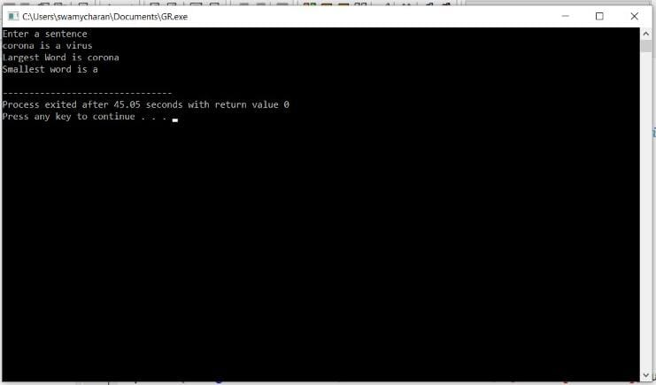

# ASSIGNMENT - 3 - STRINGS IN C
------------------------------------------------------------------------------------------------------------------------------------------------------------------------

## PROGRAM 1 - WRITE   A   C   PROGRAM   TO   INPUT   A   STRING   AND   PRINT   IT 

## CODE :
    
    #include <stdio.h>
    int main()
    {
    char z[100];

    printf("Enter a string\n");
    gets(z);

    printf("The string: %s\n", z);
    return 0;
    }

       

       

      
 

# OUTPUT :- 

------------------------------------------------------------------------------------

 
# PROGRAM 2 -WRITE  A  C  PROGRAM  TO  FIND  THE  LENGTH  OF  STRING  WITHOUT  USING  LIBRARY  FUMCTION
 
 
 ## CODE : 

    
     #include <stdio.h>
    #include <string.h>
    int main()
    {
    char str1[50];
    int i, l = 0;

 
    printf("Input a string : ");
    scanf("%s", str1);
 
    for (i = 0; str1[i] != '\0'; i++)
    {
        l++;
    }
    printf("The string contains %d  number of characters. \n",l);
    printf("So, the length of the string %s is : %d\n\n", str1, l);
    }

# OUTPUT :
 
 

------------------------------------------------------------------------------------

# PROGRAM 3- WRITE  A  C  PROGRAM  TO  COUNT  THE  TOTAL  NUMBER  OF  WORDS  IN  A  STRING 

# CODE:- 
 

    #include <stdio.h>
    #include <string.h>
 
    int main()
    {
    char s[1000];  
    int i,words=0;
 
    printf("Enter  the string : ");
    gets(s);
     
    for(i=0;s[i];i++)  
    {
    	if(s[i]==32)
    	 words++;
 
 	}
 	if(i>0)
 	 words++;
 	 
 	
      
    printf("no of words in string = %d\n",words);
    
    return 0;
    } 

# OUTPUT :- 

-----------------------------------------------------------------------------------

# PROGRAM 4 - WRITE  A  C  PROGRAM  TO  COUNT  TOTAL  NUMBER  OF  ALPHABETS  DIGITS  AND  SPECIAL  CHARACTERS  IN  A  STRING 

# CODE :-
    
    #include <stdio.h>
    #include <string.h>
 
    int main()
    {
    char s[1000]; 
    int i,alphabets=0,digits=0,specialcharacters=0;
 
    printf("Enter  the string : ");
    gets(s);
     
    for(i=0;s[i];i++)  
    {
        if((s[i]>=65 && s[i]<=90)|| (s[i]>=97 && s[i]<=122) )
          alphabets++;
        else if(s[i]>=48 && s[i]<=57)
         digits++;
        else
         specialcharacters++;
 
 	}
 	
     
    printf("Alphabets = %d\n",alphabets);
    printf("Digits = %d\n",digits);
    printf("Special characters = %d", specialcharacters);
    
 
    return 0;
    }
 

# OUTPUT :- 

 

-----------------------------------------------------------------------------------

# PROGRAM 5 - WRITE  A  C  PROGRAM  TO  COUNT  TOTAL NUMBER  OF  VOWELS  AND CONSONENTS  IN  A  STRING 

# CODE :-

    #include <stdio.h>
    #include <string.h>
    #include <stdlib.h>

    #define str_size 100 
    int main()
    {
    char str[str_size];
    int i, len, vowel, cons;
       printf("Input the string : ");
       fgets(str, sizeof str, stdin);	

    vowel = 0;
    cons = 0;
    len = strlen(str);

    for(i=0; i<len; i++)
    {

        if(str[i] =='a' || str[i]=='e' || str[i]=='i' || str[i]=='o' || str[i]=='u' || str[i]=='A' || str[i]=='E' || str[i]=='I' || str[i]=='O' || str[i]=='U')
        {
            vowel++;
        }
        else if((str[i]>='a' && str[i]<='z') || (str[i]>='A' && str[i]<='Z'))
        {
            cons++;
        }
    }
    printf("\nThe total number of vowel in the string is : %d\n", vowel);
    printf("The total number of consonant in the string is : %d\n\n", cons);
    }
  

 # OUTPUT :- 

 

-----------------------------------------------------------------------------------

# PROGRAM 6 - WRITE  A  C  PROGRAM  TO  FIND  MAXIMUM  OCCURING  CHARACTER  IN  A  STRING

# CODE :-
    #include <stdio.h>
    #include <string.h>
 
    int main()
    {
  	char str[100], result;
  	int i, len;
  	int max = -1;
  	
  	int freq[256] = {0}; 
 
  	printf("\n Please Enter any String :  ");
  	gets(str);
  	
  	len = strlen(str);
  	
  	for(i = 0; i < len; i++)
  	{
  		freq[str[i]]++;
	}
  		
  	for(i = 0; i < len; i++)
  	{
		if(max < freq[str[i]])
		{
			max = freq[str[i]];
			result = str[i];
		}
	}
	printf("\n The Maximum Occurring Character in a Given String = %c ", result);
	
  	return 0;
    }

# OUTPUT :- 

 

-----------------------------------------------------------------------------------

# PROGRAM 7 - WRITE  A  C  PROGRAM  TO  SORT  A  STRING  ARRAY  IN  ASCENDING  ORDER

# CODE :-

    #include<stdio.h>
    #include<string.h>
    int main(){
    int i,j,count;
    char str[25][25],temp[25];
    puts("How many strings u are going to enter?: ");
    scanf("%d",&count);

    puts("Enter Strings one by one: ");
    for(i=0;i<=count;i++)
      gets(str[i]);
    for(i=0;i<=count;i++)
      for(j=i+1;j<=count;j++){
         if(strcmp(str[i],str[j])>0){
            strcpy(temp,str[i]);
            strcpy(str[i],str[j]);
            strcpy(str[j],temp);
         }
      }
    printf("Order of Sorted Strings:");
    for(i=0;i<=count;i++)
      puts(str[i]);
   
    return 0;
    }

 # OUTPUT :- 

 

-----------------------------------------------------------------------------------

# PROGRAM 8 - WRITE  A  C  PROGRAM  TO  CHECK  WHEATHER  A  GIVEN  SUBSTRING  IS  PRESENT  IN  A  GIVEN  STRING 

# CODE :-

    #include<stdio.h>
 
    int main()
    {
    char str[80], search[10];
    int count1 = 0, count2 = 0, i, j, flag;
 
    printf("Enter a string:");
    gets(str);
    printf("Enter search substring:");
    gets(search);
    while (str[count1] != '\0')
        count1++;
    while (search[count2] != '\0')
        count2++;
    for (i = 0; i <= count1 - count2; i++)
    {
        for (j = i; j < i + count2; j++)
        {
            flag = 1;
            if (str[j] != search[j - i])
            {
                flag = 0;
                break;
            }
        }
        if (flag == 1)
            break;
    }
    if (flag == 1)
        printf("SEARCH SUCCESSFUL!");
    else
        printf("SEARCH UNSUCCESSFUL!");
 
    return 0;
    }

 # OUTPUT :- 

 

-----------------------------------------------------------------------------------

# PROGRAM 9 - WRITE  A  C  PROGRAM  TO  READ  A  SENTENCE  A  REPLACE  A  LOWER  CASE  CHARACTER  BY  A  UPPER  CASE  AND  VICE  VERSA  

# CODE :-

    #include<stdio.h>
    #include<string.h>

    int main()
    {
        char str[20];
        int i;
        printf("\nEnter any string :: ");
        gets(str);

        printf("\nThe input String is :: [ %s ]\n",str);
        for(i=0;i<=strlen(str);i++)
    {
                if(str[i]>=97&&str[i]<=122)
                        str[i]=str[i]-32;
                else if(str[i]>=65&&str[i]<=90)
                        str[i]=str[i]+32;
                else;
        }
        printf("\nThe Converted String is :: [ %s ]\n",str);

        return 0;
    }

 # OUTPUT :- 

 
 
-----------------------------------------------------------------------------------

# PROGRAM 10 - WRITE  A  C  PROGRAM  TO  FIND  THE  LARGEST  AND SMALLEST  WORD  IN  A  STRING 

# CODE :-

    #include<stdio.h>
    #include<string.h>
    main()
    {
    int i=0,j=0,k=0,a,minIndex=0,maxIndex=0,max=0,min=0;
    char str1[100]={0},substr[100][100]={0},c;
    printf("Enter a sentence\n");
    gets(str1);
    while(str1[k]!='\0')//for splitting sentence
    {
        j=0;
        while(str1[k]!=' '&&str1[k]!='\0')
        {
            substr[i][j]=str1[k];
            k++;
            j++;
        }
        substr[i][j]='\0';
        i++;
        if(str1[k]!='\0')
        {
            k++;
        }
    }
    int len=i;
    max=strlen(substr[0]);
    min=strlen(substr[0]);
    for(i=0;i<len;i++)
    {
       a=strlen(substr[i]);
       if(a>max)
        {
            max=a;
            maxIndex=i;
        }
        if(a<min)
        {
            min=a;
            minIndex=i;
        }
    }
    printf("Largest Word is %s \nSmallest word is %s\n",substr[maxIndex],substr[minIndex]);

    }
 
 
 
 # OUTPUT :- 

 