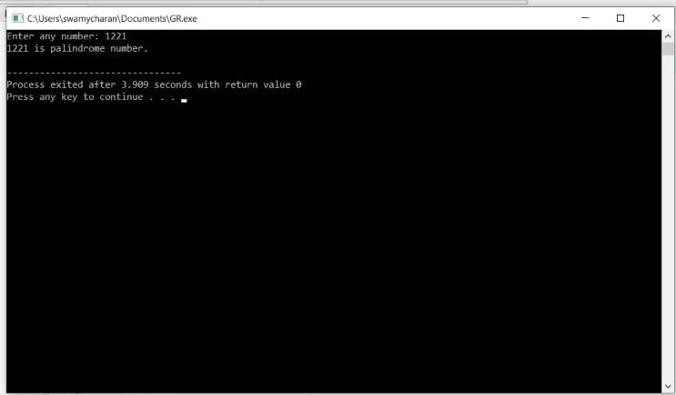

# ASSIGNMENT - 4 - FUNCTION  AND  RECURSSION  PROGRAMMING 
------------------------------------------------------------------------------------------------------------------------------------------------------------------------

## PROGRAM 1 - WRITE   A   C   PROGRAM   TO   FIND  A  CUBE  OF  ANY  NUMBER  USING  FUNCTION 

## CODE :
    
    #include <stdio.h>

    double cube(double num);

    int main()
    {
    int num;
    double c;
    
    printf("Enter any number: ");
    scanf("%d", &num);
    
    c = cube(num);

    printf("Cube of %d is %.2f", num, c); 
    
    return 0;
    }

    double cube(double num)
    {  
    return (num * num * num);
    }
       

       

      
 

# OUTPUT :- 

------------------------------------------------------------------------------------

 
# PROGRAM 2 -WRITE  A  C  PROGRAM  TO  CHECK  WHEATHER  A  NUMBER  IS PRIME  OR ARMSTRONG OR  PERFECT  NUMBER  USING  FUNCTIONS  
 
 
 ## CODE : 

    
    #include <stdio.h>
    #include <math.h>

    int isPrime(int num);
    int isArmstrong(int num);
    int isPerfect(int num);

    int main()
    {
    int num;
    
    printf("Enter any number: ");
    scanf("%d", &num);
    
    if(isPrime(num))
    {
        printf("%d is Prime number.\n", num);
    }
    else
    {
        printf("%d is not Prime number.\n", num);
    }
    
    if(isArmstrong(num))
    {
        printf("%d is Armstrong number.\n", num);
    }
    else
    {
        printf("%d is not Armstrong number.\n", num);
    }
    
    if(isPerfect(num))
    {
        printf("%d is Perfect number.\n", num);
    }
    else
    {
        printf("%d is not Perfect number.\n", num);
    }
    
    return 0;
    }

    int isPrime(int num) 
    {
    int i;
    
    for(i=2; i<=num/2; i++)  
    {  
      
        if(num%i == 0)  
        {
            return 0;
        }  
    } 
    
    return 1;  
    }

    int isArmstrong(int num) 
    {
    int lastDigit, sum, originalNum, digits;
    sum = 0;
    
    originalNum = num;

    digits = (int) log10(num) + 1;

    while(num > 0)
    {
        lastDigit = num % 10;
        sum = sum + round(pow(lastDigit, digits));

        num = num / 10;
    }
    
    return (originalNum == sum);
    }

    int isPerfect(int num) 
    {
    int i, sum, n;
    sum = 0;
    n = num;
    
    for(i=1; i<n; i++)  
    {   
        if(n%i == 0)  
        {  
            sum += i;  
        }  
    }
    
    return (num == sum);
    } 

# OUTPUT :
 
 

------------------------------------------------------------------------------------

# PROGRAM 3- WRITE  A  C  PROGRAM  TO  PRINT  ALL  STRONG  NUMBERS  BETWEEN  GIVEN  INTERVAL  USING  FUNCTIONS  

# CODE:- 
 
    #include <stdio.h>
    long long fact(int num);
    void printStrongNumbers(int start, int end);

    int main()
    {
    int start, end;
    printf("Enter the lower limit to find strong number: ");
    scanf("%d", &start);
    printf("Enter the upper limit to find strong number: ");
    scanf("%d", &end);
    
    printf("All strong numbers between %d to %d are: \n", start, end);
    printStrongNumbers(start, end);
    
    return 0;
    }

    void printStrongNumbers(int start, int end)
    {
    long long sum;
    int num;
    
    while(start != end)
    {
        sum = 0;
        num = start;
        
        while(num != 0)
        {
            sum += fact(num % 10);
            num /= 10; 
        }
        
        if(start == sum)
        {
            printf("%d, ", start);
        }
        
        start++;
    }
    }

    long long fact(int num)
    {
    if(num == 0)
        return 1;
    else
        return (num * fact(num-1));
    }

# OUTPUT :- 

-----------------------------------------------------------------------------------

# PROGRAM 4 - WRITE  A  C  PROGRAM  TO  PRINT  ALL ARMSTRONG  NUMBERS  BETWEEN  GIVEN  INTERVALS  USING  FUNCTIONS   

# CODE :-
    
    #include <stdio.h>

    int isArmstrong(int num);
    void printArmstrong(int start, int end);

    int main()
    {
    int start, end;
    printf("Enter lower limit to print armstrong numbers: ");
    scanf("%d", &start);
    printf("Enter upper limit to print armstrong numbers: ");
    scanf("%d", &end);
    
    printf("All armstrong numbers between %d to %d are: \n", start, end);
    printArmstrong(start, end);
    
    return 0;
    }

    int isArmstrong(int num)
    {
    int temp, lastDigit, sum;
    
    temp = num;
    sum = 0;
    while(temp != 0)
    {
        lastDigit = temp % 10;
        sum += lastDigit * lastDigit * lastDigit;
        temp /= 10;
    }
    
    if(num == sum)
        return 1;
    else 
        return 0;
    }

    void printArmstrong(int start, int end)
    {
    while(start <= end)
    {
        if(isArmstrong(start)) 
        {
            printf("%d, ", start);
        }
        
        start++;
    }
    }

# OUTPUT :- 

 

-----------------------------------------------------------------------------------

# PROGRAM 5 - WRITE  A  C  PROGRAM  TO  FIND  REVERSE  OF  ANY  NUMBER  USING  RECURSSION 

# CODE :-

    #include <stdio.h>
    #include <math.h>
    int reverse(int num);
    int main()
    {
    int num, rev;
   
    printf("Enter any number: ");
    scanf("%d", &num);
    
    rev = reverse(num); 
    
    printf("Reverse of %d = %d", num, rev);
    
    return 0;
    }

    int reverse(int num)
    {
    int digit = (int) log10(num);
    
    if(num == 0)
        return 0;
    
    return ((num%10 * pow(10, digit)) + reverse(num/10));
    }

 # OUTPUT :- 

 

-----------------------------------------------------------------------------------

# PROGRAM 6 - WRITE  A  C  PROGRAM  TO  CHECK  WHEATHER  A  NUMBER  A  NUMBER  IS  PALINDROME  OR NOT  USING  RECURSSION 

# CODE :-
    
  	#include <stdio.h>
    #include <math.h>

    int reverse(int num);
    int isPalindrome(int num);

    int main()
    {
    int num;
    printf("Enter any number: ");
    scanf("%d", &num);
    
    if(isPalindrome(num) == 1)
    {
        printf("%d is palindrome number.\n", num);
    }
    else
    {
        printf("%d is NOT palindrome number.\n", num);
    }
    
    return 0;
    }

    int isPalindrome(int num)
    {
   
    if(num == reverse(num))
    {
        return 1;
    }
    
    return 0;
    }

    int reverse(int num)
    {
    int digit = (int)log10(num);
    
    if(num == 0)
        return 0;

    return ((num%10 * pow(10, digit)) + reverse(num/10));
    }

# OUTPUT :- 

 

-----------------------------------------------------------------------------------

# PROGRAM 7 - WRITE  A  C  PROGRAM  TO  FIND  SUM  OF  DIGITS  OF  A  GIVRN  NUMBER  USING  RECURSSION 

# CODE :-

    #include <stdio.h>
    int sumOfDigits(int num);
    int main()
    {
    int num, sum;
    
    printf("Enter any number to find sum of digits: ");
    scanf("%d", &num);
    
    sum = sumOfDigits(num);
    
    printf("Sum of digits of %d = %d", num, sum);
    
    return 0;
    }
    int sumOfDigits(int num)
    {
    if(num == 0)
        return 0;
        
    return ((num % 10) + sumOfDigits(num / 10));
    }

 # OUTPUT :- 

 

-----------------------------------------------------------------------------------

# PROGRAM 8 - WRITE  A  C  PROGRAM  TO  FIND  FACTORIAL  OF  ANY  NUMBER  USING  RECURSSUION 

# CODE :-

    #include <stdio.h>
 
    int factorial(int);
 
    int main()
    {
    int num;
    int result;
 
    printf("Enter a number to find it's Factorial: ");
    scanf("%d", &num);
    if (num < 0)
    {
        printf("Factorial of negative number not possible\n");
    }
    else
    {
        result = factorial(num);
        printf("The Factorial of %d is %d.\n", num, result);
    }
    return 0;
    }
    int factorial(int num)
    {
    if (num == 0 || num == 1)
    {
        return 1;
    }
    else
    {
        return(num * factorial(num - 1));
    }
    }  

 # OUTPUT :- 

 

-----------------------------------------------------------------------------------

# PROGRAM 9 - WRITE  A  C  PROGRAM  TO  GENERATE  Nth  FIBONNACI TERM  USING  RECURSSION  

# CODE :-

    #include <stdio.h>
    int fibo(int);
 
    int main()
    {
    int num;
    int result;
 
    printf("Enter the nth number in fibonacci series: ");
    scanf("%d", &num);
    if (num < 0)
    {
        printf("Fibonacci of negative number is not possible.\n");
    }
    else
    {
        result = fibo(num);
        printf("The %d number in fibonacci series is %d\n", num, result);
    }
    return 0;
    }
    int fibo(int num)
    {
    if (num == 0)
    {
        return 0;
    }
    else if (num == 1)
    {
        return 1;
    }
    else
    {
        return(fibo(num - 1) + fibo(num - 2));
    }
    }

 # OUTPUT :- 

 
 
-----------------------------------------------------------------------------------

# PROGRAM 10 - WRITE  A  C  PROGRAM  TO  FIND  MAXIMUM  AND  MINIMUM  ELEMENTS  USING ARRAY  USING  RECURSSION 

# CODE :-

    
     #include <stdio.h>
    #define MAX_SIZE 100
 
    int Findmaxnumber(int array[], int index, int len);
    int Findminnumber(int array[], int index, int len);
 
 
    int main()
    {
    int array[MAX_SIZE], Num, max, min;
    int i;
 
    printf("Enter size of the array: ");
    scanf("%d", &Num);
    printf("Enter %d elements in array: ", Num);
    for(i=0; i<Num; i++)
    {
        scanf("%d", &array[i]);
    }
 
    max = Findmaxnumber(array, 0, Num);
    min = Findminnumber(array, 0, Num);
 
    printf("Minimum element in array: %d\n", min);
    printf("Maximum element in array: %d\n", max);
 
    return 0;
    }
    int Findmaxnumber(int array[], int index, int len)
    {
    int max;
    if(index >= len-2)
    {
        if(array[index] > array[index + 1])
            return array[index];
        else
            return array[index + 1];
    }
 
    max = Findmaxnumber(array, index + 1, len);
 
    if(array[index] > max)
        return array[index];
    else
        return max;
    }
    int Findminnumber(int array[], int index, int len)
    {
    int min;
 
    if(index >= len-2)
    {
        if(array[index] < array[index + 1])
            return array[index];
        else
            return array[index + 1];
    }
 
    min = Findminnumber(array, index + 1, len);
 
    if(array[index] < min)
        return array[index];
    else
        return min;
    }
 
 
 # OUTPUT :- 

 