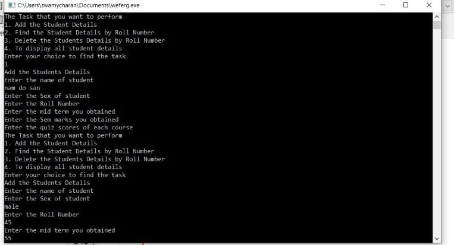

# ASSIGNMENT - 5
------------------------------------------------------------------------------------------------------------------------------------------------------------------------

# PROGRAM - Structure: Student Record Write a C program to keep records and perform statistical analysis for a class of 20 students. The information of each student contains ID, Name, Sex, quizzes Scores (2 quizzes per semester), mid-term score, final score, and total score.  The program will prompt the user to choose the operation of records from a menu as shown below: 

=========================================== 
###               Menu
============================================
### 1. Add student records

### 2. Delete student records

### 3. View all student records

### 4. Display student details by ID

# code : - 

    #include<stdio.h>
    int i = 0;
    int j,k;  
    struct sinfo {
    char name[50];
    char sex[50];
    int roll;
    float mid;
    float q[2];
    float sem;
    }st[10];

    void add_student()
    {
 	
    printf("Add the Students Details\n");

    
	printf("Enter the name of student\n");
    scanf("%s", &st[i].name);
    
	printf("Enter the Sex of student\n");
    scanf("%s", &st[i].sex);
    
	printf("Enter the Roll Number\n");
    scanf("%d", &st[i].roll);
    
	printf("Enter the mid term you obtained\n");
    scanf("%f", &st[i].mid);
    
    printf("Enter the Sem marks you obtained\n");
    scanf("%f", &st[i].sem);
          
	printf("Enter the quiz scores of each course\n");
    
	for (j = 0; j < 2; j++)
	{
        scanf("%f", &st[i].q[j]);
    }
    i+=1;
    }

    void del_s()
    {
    int a;
    printf("Enter the Roll Number which you want to delete\n");
    scanf("%d", &a);
     
    for (j = 0; j < i; j++) {
        if (a == st[j].roll) {
            for ( k = j; k < 10; k++)
                st[k] = st[k + 1];
            i--;
        }
    }
    printf("The Roll Number is removed Successfully\n");
    }

    void det()
    {		
        int s=0;
		for (j=0; j<i; j++) 
		{         
            printf("The Students Details are\n");
            printf("The First name is %s\n",st[j].name);
            printf("The Sex is %s\n",st[j].sex);
            printf("The Mid term is %f\n",st[j].mid);
            printf("The Sem Marks is %f\n",st[j].sem);
            printf("The Quiz scores are:\n");
			for (k = 0; k < 2; k++)
			{
            printf("The quiz %d score is %f\n",k+1,st[j].q[k]);
            s+=st[j].q[k];
       		}
        	printf("The Total Marks is %f\n",st[j].sem+st[j].mid+s);
    	}
    }
    void find_rl()
    {
    int s=0;
	int x;
    printf("Enter the Roll Number"
           " of the student\n");
    scanf("%d", &x);
    for (j = 0; j < i; j++) {
        if (x == st[j].roll) {
            printf(
                "The Students Details are\n");
            printf(
                "The name is %s\n",
                st[j].name);
            printf(
                "The Sex is %s\n",
                st[j].sex);
            printf("The mid-term is %f\n",st[j].mid);
            printf("The sem marks are %f\n",st[j].sem);
            printf("The Quiz scores are:\n");
        
        for (k = 0; k < 2; k++) {
            printf("The quiz %d score are %f\n",k+1,st[j].q[k]);
            s+=st[j].q[k];
        }
         printf("The Total Marks %f\n",st[j].sem+s+st[j].mid);
        break;
    }
    }
    }

    int main()
    {
	
    int choice, count;
    while (i>=0) 
	{
        printf("The Task that you want to perform\n");
        
		printf("1. Add the Student Details\n");
        
		printf("2. Find the Student Details by Roll Number\n");
        
        printf("3. Delete the Students Details by Roll Number\n");
        
        printf("4. To display all student details\n");
        
		printf("Enter your choice to find the task\n");
        scanf("%d", &choice);
        switch (choice) 
		{
        case 1: add_student();
            break;
        case 2: find_rl();
            break;
		case 3: del_s();
            break;    
        case 4: det();
            break;
        }
    } 
    }

# output - 

