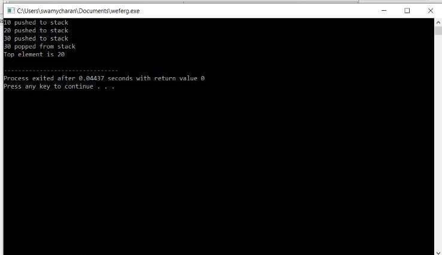
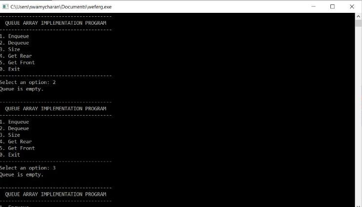

# ASSIGNMENT - 6
------------------------------------------------------------------------------------------------------------------------------------------------------------------------

# PROGRAM  1:- Write a C program to demonstrate Stack: implement the following functions
### Push
### Pop
### isEmpty
### Size
### Peak

# CODE : - 

    #include <limits.h>
   #include <stdio.h>
    #include <stdlib.h>
 
    // A structure to represent a stack

    struct StackNode {

    int data;

    struct StackNode* next;
    };
 

    struct StackNode* newNode(int data)
    {

    struct StackNode* stackNode = 

      (struct StackNode*)

      malloc(sizeof(struct StackNode));

    stackNode->data = data;

    stackNode->next = NULL;

    return stackNode;
    }
 

    int isEmpty(struct StackNode* root)
    {

    return !root;
    }
 

    void push(struct StackNode** root, int data)
    {

    struct StackNode* stackNode = newNode(data);

    stackNode->next = *root;

    *root = stackNode;

    printf("%d pushed to stack\n", data);
    }
 

    int pop(struct StackNode** root)
    {

    if (isEmpty(*root))

        return INT_MIN;

    struct StackNode* temp = *root;

    *root = (*root)->next;

    int popped = temp->data;

    free(temp);
 

    return popped;
    }
 

    int peek(struct StackNode* root)
    {

    if (isEmpty(root))

        return INT_MIN;

    return root->data;
    }
 

    int main()
    {

    struct StackNode* root = NULL;
 

    push(&root, 10);

    push(&root, 20);

    push(&root, 30);
 

    printf("%d popped from stack\n", pop(&root));
 

    printf("Top element is %d\n", peek(root));
 

    return 0;
    }

# OUTPUT :- 

------------------------------------------------------------------------------------

# PROGRAM 2 - Write a C Priogram to demonstrate Queues: implement the following functionalities:
### Enqueue
### Dequeue
### Front
### Rear
### isEmpty 

# CODE : -    

    #include <stdio.h>
    #include <stdlib.h>
    #include <limits.h>

    #define CAPACITY 100

    int queue[CAPACITY];
    unsigned int size  = 0;
    unsigned int rear  = CAPACITY - 1;   // Initally assumed that rear is at end
    unsigned int front = 0;
    int enqueue(int data);
    int dequeue();
    int isFull();
    int isEmpty();
    int getRear();
    int getFront();

    int main()
    {
    int ch, data;

    /* Run indefinitely until user manually terminates */
    while (1)
    {
        /* Queue menu */
        printf("--------------------------------------\n");
        printf("  QUEUE ARRAY IMPLEMENTATION PROGRAM  \n");
        printf("--------------------------------------\n");
        printf("1. Enqueue\n");
        printf("2. Dequeue\n");
        printf("3. Size\n");
        printf("4. Get Rear\n");
        printf("5. Get Front\n");
        printf("0. Exit\n");
        printf("--------------------------------------\n");
        printf("Select an option: ");

        scanf("%d", &ch);

        
        /* Menu control switch */
        switch (ch)
        {
            case 1:
                printf("\nEnter data to enqueue: ");
                scanf("%d", &data);

                // Enqueue function returns 1 on success
                // otherwise 0
                if (enqueue(data))
                    printf("Element added to queue.");
                else
                    printf("Queue is full.");

                break;

            case 2:
                data = dequeue();

                // on success dequeue returns element removed
                // otherwise returns INT_MIN
                if (data == INT_MIN)
                    printf("Queue is empty.");
                else
                    printf("Data => %d", data);

                break;

            case 3: 

                // isEmpty() function returns 1 if queue is emtpy 
                // otherwise returns 0
                if (isEmpty())
                    printf("Queue is empty.");
                else 
                    printf("Queue size => %d", size);

                break;

            case 4: 

                if (isEmpty())
                    printf("Queue is empty.");
                else 
                    printf("Rear => %d", getRear());

                break;

            case 5: 

                if (isEmpty())
                    printf("Queue is empty.");
                else 
                    printf("Front => %d", getFront());

                break;

            case 0:
                printf("Exiting from app.\n");
                exit(0);
        
            default:
                printf("Invalid choice, please input number between (0-5).");
                break;
        }

        printf("\n\n");
    }
    }

    int enqueue(int data)
    {
    // Queue is full throw Queue out of capacity error.
    if (isFull()) 
    {
        return 0;
    }

    // Ensure rear never crosses array bounds
    rear = (rear + 1) % CAPACITY;

    // Increment queue size
    size++;

    // Enqueue new element to queue
    queue[rear] = data;

    // Successfully enqueued element to queue
    return 1;
    }

    int dequeue()
    {
    int data = INT_MIN;

    // Queue is empty, throw Queue underflow error
    if (isEmpty())
    {
        return INT_MIN;
    }

    // Dequeue element from queue
    data = queue[front];

    // Ensure front never crosses array bounds
    front = (front + 1) % CAPACITY;

    // Decrease queue size
    size--;

    return data;
    }

    int isFull()
    {
    return (size == CAPACITY);
    }

    int isEmpty()
    {
    return (size == 0);
    }

    int getFront()
    {
    return (isEmpty())
            ? INT_MIN
            : queue[front];
    }

    int getRear()
    {
    return (isEmpty())
            ? INT_MIN
            : queue[rear];
    }

# OUTPUT - 

