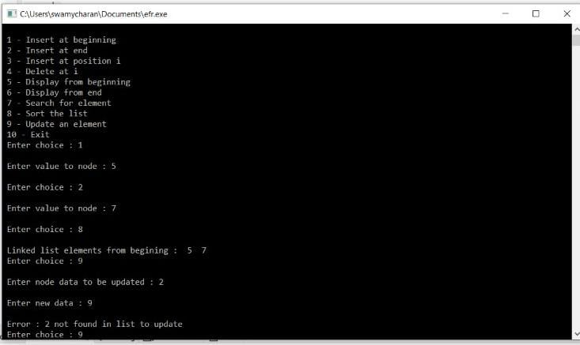

# ASSIGNMENT - 7
------------------------------------------------------------------------------------------------------------------------------------------------------------------------

# PROGRAM  :- Write a C program to demonstrate Linked List : implement the following function 
 Traversal  

Insertion  

Deletion  

Searching  

Updating  

Sorting

# CODE :- 

    #include <stdio.h>
    #include <stdlib.h>
 
    struct node
    {
    struct node *prev;
    int n;
    struct node *next;
    } 
    *h,*temp,*temp1,*temp2,*temp4;
 
    int insert1();
    int insert2();
    int insert3();
    int traversebeg();
    int traverseend();
    int sort();
    int search();
    int update(); 
    int del();

    int count = 0;
 
    int main()
    {
    int ch;
 
    h = NULL;
    temp = temp1 = NULL;
 
    printf("\n 1 - Insert at beginning");
    printf("\n 2 - Insert at end");
    printf("\n 3 - Insert at position i");
    printf("\n 4 - Delete at i");
    printf("\n 5 - Display from beginning");
    printf("\n 6 - Display from end");
    printf("\n 7 - Search for element");
    printf("\n 8 - Sort the list");
    printf("\n 9 - Update an element");
    printf("\n 10 - Exit");
 
    while (1)
    {
        printf("\n Enter choice : ");
        scanf("%d", &ch);
        switch (ch)
        {
        case 1:
            insert1();
            break;
        case 2:
            insert2();
            break;
        case 3:
            insert3();
            break;
        case 4:
            del();
            break;
        case 5:
            traversebeg();
            break;
        case 6:
            temp2 = h;
            if (temp2 == NULL)
                printf("\n Error : List empty to display ");
            else
            {
                printf("\n Reverse order of linked list is : ");
                
            }
            break;
        case 7:
            search();
            break;
        case 8:
            sort();
            break;
        case 9:
            update();
            break;
        case 10:
            exit(0);
        default:
            printf("\n Wrong choice menu");
        }
    }
    }
 
    /* TO create an empty node */
    void create()
    {
    int data;
 
    temp =(struct node *)malloc(1*sizeof(struct node));
    temp->prev = NULL;
    temp->next = NULL;
    printf("\n Enter value to node : ");
    scanf("%d", &data);
    temp->n = data;
    count++;
    }
 
    /*  TO insert at beginning */
    int insert1()
    {
    if (h == NULL)
    {
        create();
        h = temp;
        temp1 = h;
    }
    else
    {
        create();
        temp->next = h;
        h->prev = temp;
        h = temp;
    }
    }
 
    /* To insert at end */
    int insert2()
    {
    if (h == NULL)
    {
        create();
        h = temp;
        temp1 = h;
    }
    else
    {
        create();
        temp1->next = temp;
        temp->prev = temp1;
        temp1 = temp;
    }
    }
 
    /* To insert at any position */
    int insert3()
    {
    int pos, i = 2;
 
    printf("\n Enter position to be inserted : ");
    scanf("%d", &pos);
    temp2 = h;
 
    if ((pos < 1) || (pos >= count + 1))
    {
        printf("\n Position out of range to insert");
        
    }
    if ((h == NULL) && (pos != 1))
    {
        printf("\n Empty list cannot insert other than 1st position");
        
    }
    if ((h == NULL) && (pos == 1))
    {
        create();
        h = temp;
        temp1 = h;
        
    }
    else
    {
        while (i < pos)
        {
            temp2 = temp2->next;
            i++;
        }
        create();
        temp->prev = temp2;
        temp->next = temp2->next;
        temp2->next->prev = temp;
        temp2->next = temp;
    }
    }
 
    /* To delete an element */
    int del()
    {
    int i = 1, pos;
 
    printf("\n Enter position to be deleted : ");
    scanf("%d", &pos);
    temp2 = h;
 
    if ((pos < 1) || (pos >= count + 1))
    {
        printf("\n Error : Position out of range to delete");
        
    }
    if (h == NULL)
    {
        printf("\n Error : Empty list no elements to delete");
        
    }
    else
    {
        while (i < pos)
        {
            temp2 = temp2->next;
            i++;
        }
        if (i == 1)
        {
            if (temp2->next == NULL)
            {
                printf("Node deleted from list");
                free(temp2);
                temp2 = h = NULL;
               
            }
        }
        if (temp2->next == NULL)
        {
            temp2->prev->next = NULL;
            free(temp2);
            printf("Node deleted from list");
            
        }
        temp2->next->prev = temp2->prev;
        if (i != 1)
            temp2->prev->next = temp2->next;    /* Might not need this statement if i == 1 check */
        if (i == 1)
            h = temp2->next;
        printf("\n Node deleted");
        free(temp2);
    }
    count--;
    } 
 
    /* Traverse from beginning */
    int traversebeg()
    {
    temp2 = h;
 
    if (temp2 == NULL)
    {
        printf("List empty to display \n");
        
    }
    printf("\n Linked list elements from begining : ");
 
    while (temp2->next != NULL)
    {
        printf(" %d ", temp2->n);
        temp2 = temp2->next;
    }
    printf(" %d ", temp2->n);
    }
 
    /* To traverse from end recursively */
    int traverseend(int i)
    {
    if (temp2 != NULL)
    {
        i = temp2->n;
        temp2 = temp2->next;
        traverseend(i);
        printf(" %d ", i);
    }
    }
 
    /* To search for an element in the list */
    int search()
    {
    int data, count = 0;
    temp2 = h;
 
    if (temp2 == NULL)
    {
        printf("\n Error : List empty to search for data");
        
    }
    printf("\n Enter value to search : ");
    scanf("%d", &data);
    while (temp2 != NULL)
    {
        if (temp2->n == data)
        {
            printf("\n Data found in %d position",count + 1);
            
        }
        else
             temp2 = temp2->next;
            count++;
    }
    printf("\n Error : %d not found in list", data);
    }
 
    /* To update a node value in the list */
    int update()
    {
    int data, data1;
 
    printf("\n Enter node data to be updated : ");
    scanf("%d", &data);
    printf("\n Enter new data : ");
    scanf("%d", &data1);
    temp2 = h;
    if (temp2 == NULL)
    {
        printf("\n Error : List empty no node to update");
        
    }
    while (temp2 != NULL)
    {
        if (temp2->n == data)
        {
 
            temp2->n = data1;
            traversebeg();
           
        }
        else
            temp2 = temp2->next;
    }
 
    printf("\n Error : %d not found in list to update", data);
    }
 
    /* To sort the linked list */
    int sort()
    {
    int i, j, x;
 
    temp2 = h;
    temp4 = h;
 
    if (temp2 == NULL)
    {
        printf("\n List empty to sort");
        
    }
 
    for (temp2 = h; temp2 != NULL; temp2 = temp2->next)
    {
        for (temp4 = temp2->next; temp4 != NULL; temp4 = temp4->next)
        {
            if (temp2->n > temp4->n)
            {
                x = temp2->n;
                temp2->n = temp4->n;
                temp4->n = x;
            }
        }
    }
    traversebeg();
    }
    
 # OUTPUT := 

