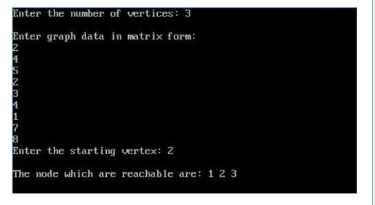
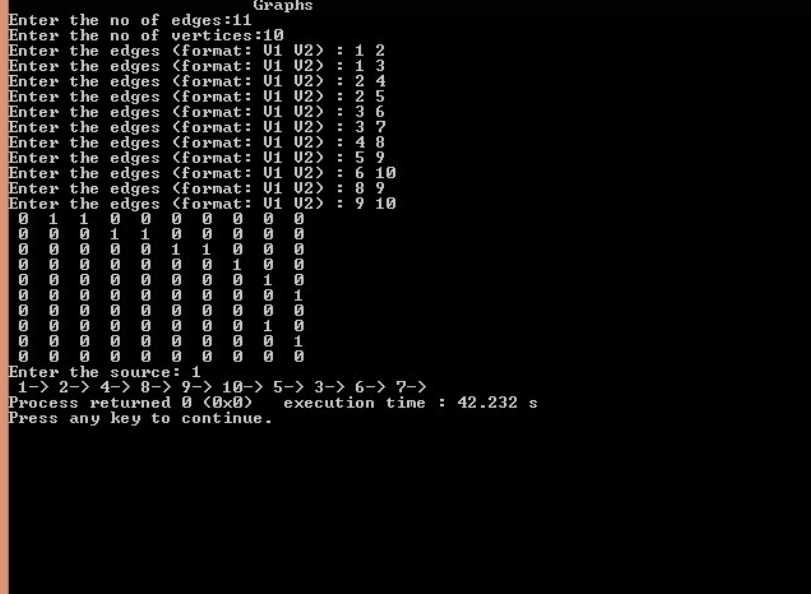

# ASSIGNMENT - 9
------------------------------------------------------------------------------------------------------------------------------------------------------------------------

# PROGRAM  :- Write a C program to demonstrate Graphs : implement the following graph traversal techniques
## Breadth First Search
## Depth First Search

# CODE :-  

## BREAK FIRST SEARCH 

    #include<stdio.h>

    #include<conio.h>

    int a[20][20], q[20], visited[20], n, i, j, f = 0, r = -1; 

    void bfs(int v) {

    for(i = 1; i <= n; i++)

    if(a[v][i] && !visited[i])

    q[++r] = i;

    if(f <= r) {

    visited[q[f]] = 1;

    bfs(q[f++]);

    }

    }

    void main() {

    clrscr();

    int v;

    printf("Enter the number of vertices: ");

    scanf("%d",&n);

    for(i=1; i <= n; i++) {
 
    q[i] = 0;

    visited[i] = 0;

    }

    printf("\nEnter graph data in matrix form:\n");

    for(i=1; i<=n; i++) {

    for(j=1;j<=n;j++) {

    scanf("%d", &a[i][j]);

    }

    }

    printf("Enter the starting vertex: ");

    scanf("%d", &v);

    bfs(v);

    printf("\nThe node which are reachable are:");

    for(i=1; i <= n; i++) {

    if(visited[i])

    printf(" %d", i);

    else {

    printf("\nBFS is not possible. All nodes are not reachable!");

    break;

    }

    }

    getch();

    }

# OUTPUT :- 

## Depth First Search 

### code :- 

    #include <stdio.h>
    #include <stdlib.h>                           */
    int source,V,E,time,visited[20],G[20][20];
    void DFS(int i)
    {
    int j;
    visited[i]=1;
    printf(" %d->",i+1);
    for(j=0;j<V;j++)
    {
        if(G[i][j]==1&&visited[j]==0)
            DFS(j);
    }
    }
    int main()
    {
    int i,j,v1,v2;
    printf("\t\t\tGraphs\n");
    printf("Enter the no of edges:");
    scanf("%d",&E);
    printf("Enter the no of vertices:");
    scanf("%d",&V);
    for(i=0;i<V;i++)
    {
        for(j=0;j<V;j++)
            G[i][j]=0;
    }
    /*    creating edges :P    */
    for(i=0;i<E;i++)
    {
        printf("Enter the edges (format: V1 V2) : ");
        scanf("%d%d",&v1,&v2);
        G[v1-1][v2-1]=1;

    }

    for(i=0;i<V;i++)
    {
        for(j=0;j<V;j++)
            printf(" %d ",G[i][j]);
        printf("\n");
    }
    printf("Enter the source: ");
    scanf("%d",&source);
        DFS(source-1);
    return 0;
    }

# OUTPUT: - 

