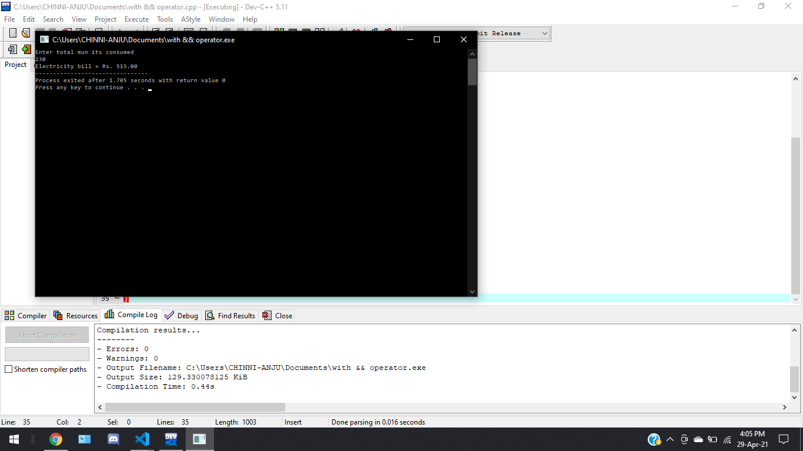

# CASE STUDY
-----------------------------------------------
# PROGRAM - ELECTRICITY BILL  

# CODE- 

    #include <stdio.h>
    #include <stdlib.h>
    int calc_Electricity(int unit);//function prototype
    int main()
    {
    //rates apply
    // 1- 50 units - 1.50
    //51- 150 units - 2.00
    //101 - 250 units - 3.00
    //above 251  units - 4.00
    int unit=0;
    printf("Enter total mun its consumed\n");
    scanf("%d",&unit);//Reads input from user and store in variable unit
    calc_Electricity(unit);//function call
    return 0;
    }
    int calc_Electricity(int unit){//function definition
    double amount;
    if(unit<=50)
    {//below 50 units
        amount=unit*1.50;
    }
    else if(unit<=150)
    {//below 150 units
        amount=((50*1.5)+(unit-50)*2.00);
    }
    else if((unit<=250)){//below 250 units
        amount=(50*1.5)+((150-50)*2.00)+(unit-150)*3.00;
    }
    else{//above 250 units
        amount=(50*1.5)+((150-50)*2.00)+((250-150)*3.00)+(unit-250)*4;
    }
    printf("Electricity bill = Rs. %.2f",amount);

# ouput -

